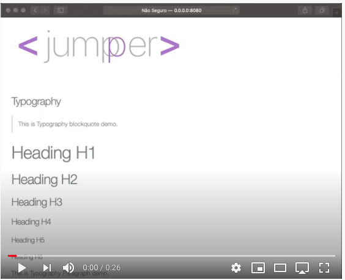

<p align="center">
    
    <br>
    <br>
    <a href="https://swift.org">
        
    </a>
    <a href="https://swift.org/package-manager">
        
    </a>
    
    
    <a href="https://raw.githubusercontent.com/jumpper/jumpper/develop/LICENSE">
    	
    </a>
    <a href="https://codebeat.co/a/michel-anderson-lutz-teixeira/projects/github-com-jumpper-jumpper-develop">
    	
    </a>
</p>

-----

Welcome to **jumpper**. Is an open source framework, which is independent of other web frameworks or toolkits available on the market, such as Vapor, Kitura and Perfect. It can be used in conjunction with any of them and even alone. This shows how simple it is to build HTML pages using only **Swift**.

The idea of this library is to facilitate the creation of static or dynamic pages.

About 10 years ago I developed a library similar to this one, but in another language, it streamlined many projects that I developed.

I decided to bring these concepts to the language I use today.

The project is still under development, feel free to collaborate and leave suggestions, fork and share.

I hope it will be useful for more developers.

> Let`s code.


# Documentation

- [Online Doc](http://jumpper-docs.micheltlutz.me)

# Vapor usage

> Need Leaf installed

```swift 
import jumpper

router.get { req -> Future<View> in
     let div = Div()
     div.add("My first div with jumpper")
     return try req.view().render("base", ["title": "Hello jumpper", "body": div.getString()])
}
```
# jumpper vapor project demo

- [jumpper-demo](https://github.com/jumpper/jumpper-demo)

# Elements Video Demo

[](https://youtu.be/p3vQgugZ0ZQ)
