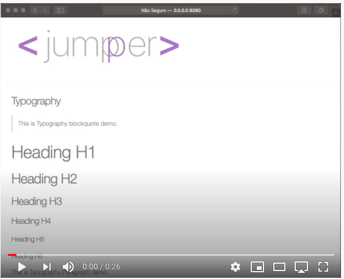

<p align="center">
    
</p>
-----

# In refactoring, 
New Swift LIB: [Winged-Swift](https://github.com/micheltlutz/Winged-Swift)
For now the python version of the project is available at: [https://github.com/micheltlutz/Winged-Python](https://github.com/micheltlutz/Winged-Python)

I will soon update this repository with improvements and evolutions following the same calls as the python version.


-----

## DEPRECATED

Welcome to **jumpper**. Is an open source framework, which is independent of other web frameworks or toolkits available on the market, such as Vapor, Kitura and Perfect. It can be used in conjunction with any of them and even alone. This shows how simple it is to build HTML pages using only **Swift**.

The idea of this library is to facilitate the creation of static or dynamic pages.

About 10 years ago I developed a library similar to this one, but in another language, it streamlined many projects that I developed.

I decided to bring these concepts to the language I use today.

The project is still under development, feel free to collaborate and leave suggestions, fork and share.

I hope it will be useful for more developers.

> Let`s code.


# Documentation

- [Online Doc](http://jumpper-docs.micheltlutz.me)

# Using in Package.swift

```swift
// swift-tools-version:5.6
import PackageDescription

let package = Package(
    name: "assessment",
    platforms: [
       .macOS(.v12)
    ],
    dependencies: [
        .package(url: "https://github.com/vapor/vapor.git", from: "4.0.0"),
        .package(url: "https://github.com/jumpper/jumpper.git", from: "0.0.9")
    ],
    targets: [
        .target(
            name: "App",
            dependencies: [
                .product(name: "Vapor", package: "vapor"),
                .product(name: "jumpper", package: "jumpper")
            ]
        ),
        .executableTarget(name: "Run", dependencies: [.target(name: "App")]),
        .testTarget(name: "AppTests", dependencies: [
            .target(name: "App"),
            .product(name: "XCTVapor", package: "vapor"),
        ])
    ]
)
```

# Vapor usage

## Need Leaf installed

```swift 
import jumpper
import Leaf
import Vapor

router.get { req -> Future<View> in
     let div = Div()
     div.add("My first div with jumpper")
     return try req.view().render("base", ["title": "Hello jumpper", "body": div.getString()])
}
```

## Without Leaf

```swift 
import jumpper
import Vapor


protocol JumpperPageProtocol {
    func render() throws -> EventLoopFuture<Response>
}

public final class IndexPage: JumpperPageProtocol {
    // MARK: - Render

    public func render() throws -> EventLoopFuture<Response> {
        let response = Response()
        
        let divC = Div()
        response.body = .init(string: divC.getString())
        return response.encodeResponse(status: .ok, headers: HTTPHeaders.init([("Content-Type", "text/html; charset=UTF-8")]), for: request)
    }
}
```

# jumpper vapor project demo

- [jumpper-demo](https://github.com/jumpper/jumpper-demo)

# Elements Video Demo

[](https://youtu.be/p3vQgugZ0ZQ)
